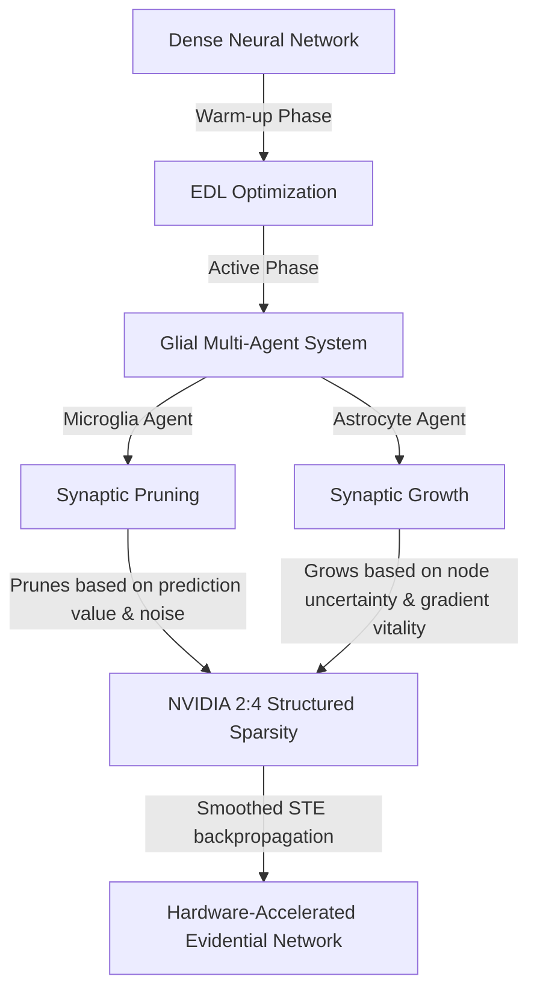

# MDEP: Microglial-Driven Evidential Pruning

[](https://pytorch.org/)
[](https://developer.nvidia.com/blog/introducing-ampere-architecture-2-4-sparse-matrix-multiplication/)
[]()

MDEP (**Microglial-Driven Evidential Pruning**) is a novel research framework that seamlessly merges **Evidential Deep Learning (EDL)** with **Dynamic Sparse Training (DST)**. Inspired by biological glial mechanisms in the human brain, MDEP models neural network structural optimization as a multi-agent cooperative system between **Microglia** (responsible for targeted synaptic pruning) and **Astrocytes** (responsible for activity-dependent synaptic growth).

This framework is mathematically designed to train highly stable, well-calibrated, and hardware-efficient deep neural networks under severe class imbalance (validated on the **ISIC 2024 Skin Cancer Detection** dataset), adhering to strict **NVIDIA Ampere 2:4 structured sparsity** constraints for 2x Tensor Core acceleration.

---

## 🧬 Biological Inspiration & Core Mechanism

In mammalian brains, learning is not just about strengthening connections (Long-Term Potententiation) but also about continuous structural plasticity governed by glial cells:



### 1. The Microglia Agent (Pruning)
Microglia cells inspect the brain, engulfing and eliminating weak or redundant synapses. In the MDEP framework, the Microglia agent evaluates weight utility based on a dual-metric driving force:
* **Task Utility ($c_1$):** Magnitude of task-specific loss gradients ($|W_{ij} \cdot \frac{\partial L}{\partial W_{ij}}|$).
* **Noise Modeling Utility ($c_2$):** Sensitivity of aleatoric uncertainty to the weight ($|W_{ij} \cdot \frac{\partial u_a}{\partial W_{ij}}|$).
$$C_{ij} = \text{Norm}(c_1) + \beta \cdot \text{Norm}(c_2)$$

### 2. The Astrocyte Agent (Growing)
Astrocytes monitor neuronal synapse activity and release growth factors to form new synapses where neurons are "blind" or overloaded.
* **Node Uncertainty Vitality ($g_1$):** Evaluates which neurons suffer from high epistemic uncertainty ($u_e$), indicating out-of-distribution (OOD) blind spots or lack of support.
* **Edge Gradient Vitality ($g_2$):** Identifies dormant weights with high loss-reduction potential ($|\frac{\partial L}{\partial W_{ij}}|$).
$$G_{ij} = \text{Norm}(g_1) \times \text{Norm}(g_2)$$

### 3. Smoothed Straight-Through Estimator (Smoothed-STE)
To optimize the discrete $2:4$ sparsity mask without gradient blocking, MDEP uses a **Smoothed-STE** with cosine-annealed temperatures ($\gamma$). The backward pass ensures gradients flow smoothly to weights near the survival boundary:
$$\frac{\partial M}{\partial S} \approx \sigma'\left(\frac{S - \tau}{\gamma}\right)$$

---

## 🛠️ Key Technical Optimizations Implemented

The MDEP repository integrates several robust fixes to stabilize Evidential Focal Loss training on highly imbalanced clinical datasets:

1. **Focal Weight Detachment:** Prevents PyTorch from backpropagating through the focal probability coefficient $(1-\hat{p}_c)^\gamma$, which otherwise distorts the Dirichlet landscape and collapses evidence.
2. **Amortized Glial Gradients:** Computes aleatoric and epistemic backpasses only once per epoch on a dedicated batch to minimize training overhead (low FLOPs).
3. ** digamma/lgamma Safety:** Guarantees all inputs to mathematical operators satisfy $\alpha \ge 1.0$ (via $\alpha = e + 1$), completely avoiding `-Inf` or `NaN` values.
4. **Focal Loss Scaling & LR Warmup:** Employs a linear learning rate warm-up (from $1e-6$ to $1e-3$ over 5 epochs) and scaled loss values (from $4.0\times$ down to $1.0\times$) to help the optimizer break out of the flat "zero-evidence" initialization region.
5. **Exact Node Autograd:** Implements forward hooks to collect exact intermediate feature activations, ensuring precise node-level epistemic uncertainty gradients.

---

## 📂 Repository Structure

The project is structured both as a multi-file modular library and a single-file portable script:

```bash
├── mdep_notebook.py           # Consolidated, single-file script ready for Kaggle/Colab
├── main.py                    # Multi-file execution entry point
├── trainer.py                 # MDEPTrainer class with AMP, Warmup, and Amortized gradients
├── mdep_agents.py             # MDEPLinear, MDEPConv2d, SmoothedSTE, and Glial scoring
├── losses.py                  # EvidentialFocalLoss implementation with target-detach & scaling
├── edl_core.py                # Core EDL formulas (Dirichlet, Aleatoric/Epistemic uncertainties)
├── mdep_fixes_summary.md      # Detailed Vietnamese report of architectural bug fixes
├── mdep_research_report.html  # Premium HTML research report on training performance
├── debug_nan.py               # Minimal reproducible script to diagnose gradient health
├── mdep_ablation_prune_only.py# Ablation config: Microglia pruning only (Astrocyte disabled)
└── mdep_ablation_grow_only.py # Ablation config: Astrocyte growing only (Microglia disabled)
```

---

## 🚀 Getting Started

### Prerequisites
Install the required packages:
```bash
pip install torch torchvision pandas numpy scikit-learn matplotlib h5py
```

### Running the Multi-File Implementation
To train the full model on your local environment (defaults to dummy data if the ISIC dataset path `/kaggle/input` is absent):
```bash
python main.py
```

### Running Ablation Studies
Compare how the MDEP components perform independently:
```bash
# Run with Microglia (Pruning) only
python mdep_ablation_prune_only.py

# Run with Astrocyte (Growing) only
python mdep_ablation_grow_only.py
```

---

## 📊 Evaluation & Diagnostics

MDEP includes a comprehensive suite of clinical evaluation tools:
* **Expected Calibration Error (ECE):** Assesses model confidence alignment.
* **Risk-Coverage Curve & AURC:** Plots the error rate against various confidence thresholds to evaluate clinical deferral capability.
* **Representational Collapse Diagnostics:** Continuous tracking of score standard deviation, mean drift, and gradient vitality to guarantee the network does not undergo sparse-pruning death.
* **2:4 Structure Verification:** Verifies every block of 4 weights contains exactly 2 active connections, ensuring hardware-compatibility.

---

## 🤝 Citation & Reference

If you find MDEP useful in your research, please cite this repository:
```bibtex
@software{mdep2026,
  author = {Minh Duc},
  title = {MDEP: Microglial-Driven Evidential Pruning for Dynamic Sparse Training},
  year = {2026},
  publisher = {GitHub},
  journal = {GitHub Repository},
  howpublished = {\url{https://github.com/minhduc110207/MDEP-Microglial-Driven-Evidential-Pruning}}
}
```
